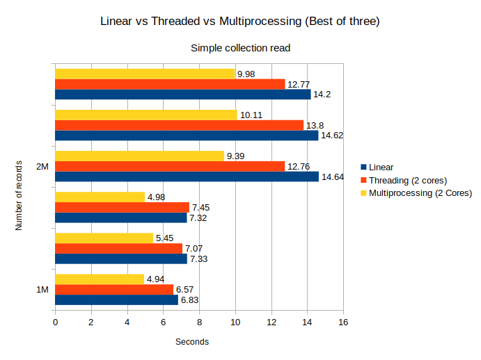
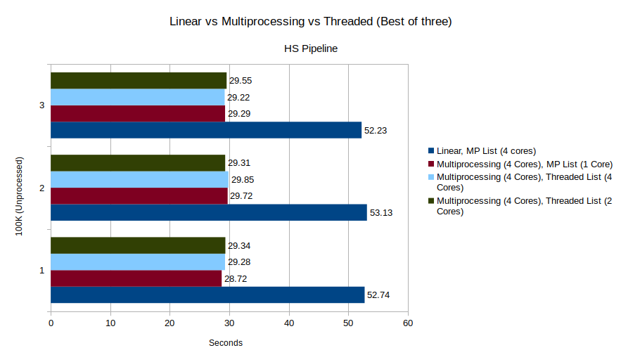

# Twitter MongoDB helper functions

A collection of python functions for dealing with MongoDB indexes, aggregation pipleline and map-reduce
[TwitterMongoDBHelper](https://idea-nthu-taiwan.github.io/twitter_mongodb_helper/)


# MongoDB Indexing

It is essential to create indexes on your fields in order to speed of the run time of your queries. A few ideal indexes will be outlined below but ultimately it will depend on your data needs.

## Resources

- [Text Search](https://docs.mongodb.com/manual/text-search/)
- [Create Text Index](https://docs.mongodb.com/manual/core/index-text/#create-a-text-index)
- [Multi-Key Indexes](https://docs.mongodb.com/manual/core/index-multikey/)
- [Compound Prefix](https://docs.mongodb.com/manual/core/index-compound/#compound-index-prefix)
- [Multi-Key Indexes](https://docs.mongodb.com/manual/core/index-multikey/)
- [Manging Indexes](https://docs.mongodb.com/v3.2/tutorial/manage-indexes/)

## Instructions

This assumes that you already have MongoDB installed and running and already populated with tweets.

Start the mongo shell from the terminal and select your database

```bash
mongo
use twitterdb
```

## Creating a text index

```bash
db.tweets.createIndex(
  {text: "text","entities.hashtags.text": "text"},
  {background:true}
)
```

This allows for "Google search" like capability on the hashtags and the text of the tweet itself. Only one text index can exist at a time. [See Text search link above]

```bash
db.tweets.find({$text:{$search: "java shop coffee"}})
```

## Creating a compound index

```bash
db.tweets.createIndex(
  {
    "user.id": 1,
    "user.statuses_count": 1,
    "user.followers_count": 1,
    "user.location":1, "user.lang": 1
  },
  {background:true}
)
```

## Creating a single field index

```bash
db.tweets.createIndex({timestamp_ms: 1}, {background: true})
db.tweets.createIndex({lang: 1}, {background:true})
db.tweets.createIndex({"entities.user_mentions": 1}, {background: true})
db.tweets.createIndex({"entities.urls": 1}, {background: true})
db.tweets.createIndex({"user.location": 1}, {background:true})
db.tweets.createIndex({"user.id_str": 1}, {background:true})
```

## Insights

- Aggregation is orders of magnitude faster than map reduce
- Queries that scan the full database may time out when executed at the application level (PyMongo etc). If this happens try running them from Mongo Shell instead

## Aggregation vs MapReduce

Get an aggregate count of all the hashtags in a collection, filtered by English. (uses mongo shell)

```bash
db.tweets.aggregate(
  [
    {$match: {"lang": {$in: ["en"]}}},
    {$project: {"entities.hashtags": 1, _id: 0}},
    {$unwind: "$entities.hashtags"},
    {$group: {_id: "$entities.hashtags.text", count: {$sum: 1}}},
    {$sort: {count: -1}},
    {$project: {"hashtag": "$_id", "count": 1, "_id": 0}},
    {$out: "hashtag_dist_en"}
  ]
)
```

Same query with MapReduce (Pymongo)

```python
def hashtag_map_reduce(client, db_name, subset, output_name):
    map_function = Code("function () {"
                        "    var hashtags = this.entities.hashtags;"
                        "    for (var i = 0; i < hashtags.length; i ++){"
                        "        if (hashtags[i].text.length > 0) {"
                        "            emit (hashtags[i].text, 1);"
                        "        }"
                        "    }"
                        "}")

    reduce_function = Code("function (keyHashtag, occurs) {"
                           "     return Array.sum(occurs);"
                           "}")
    dbo = client[db_name]
    cursor = dbo[subset].map_reduce(
        map_function, reduce_function, output_name, query={"lang": {"$eq": "en"}})
```

Aggregate user mentions, same structure as the above

```bash
db.tweets.aggregate(
  [
    {$match: {"lang": {$in: ["en"]}}},
    {$project: {"entities.user_mentions": 1, _id: 0}},
    {$unwind: "$entities.user_mentions"},
    {$group: {_id: {id_str: "$entities.user_mentions.id_str",
             "screen_name": "$entities.user_mentions.screen_name"},
             count: {$sum: 1}}},
    {$project: {id_str: "$_id.id_str", "screen_name": "$_id.screen_name",   
               "count": 1, "_id": 0}},
    {$sort: {count: -1}},
    { $out : "user_mentions_dist_en" }
  ]
)
```
## Parallel Processing

As the operations that you need to do become more complex, at some point you will start feeling the effects
of waiting on MongoDB to send data across the network or even loading from disk. MongoDB has a `parallCollectionScan` commmand
but as of this writing it does not work if you are using the WiredTiger Storage Engine. (All new MongoDB installs use this by default).
A feature request has been opened for the last two years, see [ticket](https://jira.mongodb.org/browse/SERVER-17688). If we want to process a collection
in parallel and not waste idle CPU time waiting on data to arrive then we have to get creative.

[Joblib](https://pythonhosted.org/joblib/parallel.html) is high level Python library for multiprocessing and threading and it's really easy to convert your
functions to use it. If you can read a list comprehension then you can use the library, just look at the example in their docs.

The basic idea of the trick I'm proposing is to first get a count of the number of documents in a collection and divide it into `k` slices, `k` being the number
of sub processes or threads that we want to spawn. We then use `k` connection objects and pass each slice is then passed to some function to be processed.
This approach should be database agnostic and should even work for raw files. The main idea is to split up the work.

#### Outline

First determine the size of your partitions, `partition_size = sample_size // num_cores`.

`sample_size` is the size of the collection and `num_cores` is the number of processor cores or the number of sub processes to spawn.
You may need to experiment with this, a general rule of thumb is 1 process for each core your processor has.

We need to set the start and end indices for the collection we want to access in parallel
Example, with `collection_size = 2001`, `num_cores = 4`, the list comprehension
below gives the following `skip:limit` indices:

```python
partitions = [(i, partition_size) for i in range(0, sample_size, partition_size)]
```
`(0, 500), (500, 500), (1000, 500), (1500, 500), (2000, 500)`

We then deal with the last index since it exceeds the size of the collection
```python
partitions[-1] = (partitions[-1][0], (sample_size - partitions[-1][0]))
```

The last index then becomes `(2000, 1)`

Finally, we let joblib do its magic. `process_partition` is simply a function
that creates a connection object for each sub process and
appends a list with the values from the DB collection.

```python
results = Parallel(n_jobs=num_cores)(
      delayed(process_partition)(partition, connection_params) for partition in partitions)
```

```python
def process_partition(partition, connection_params):
    client = connect()
    db_name = connection_params[0]
    collection = connection_params[1]
    dbo = client[db_name]

    cursor = dbo[collection].find({}, {"_id": 1}).skip(
        partition[0]).limit(partition[1])
    documents = {str(document["_id"]) for document in cursor}
    return documents
```

#### Results

It wouldn't be any good if I talked about all this and didn't provide any proof
of the speedup we can get. Let's look at some stats. All tests were executed on my
laptop which has an Intel Core i5-5200u with 2 physical cores and 4 threads. The MongoDB
has installed locally so there were no network delay issues at play. As mentioned, play with the
`num_cores` value and do a few tests to determine if your function is [CPU or IO bound.](https://www.quantstart.com/articles/parallelising-python-with-threading-and-multiprocessing)
Multiprocessing for CPU and Threading for IO. You can set joblib to use threading, see [here.](https://pythonhosted.org/joblib/parallel.html#using-the-threading-backend)
The tests are available in `run.py`

The following shows the results `process_partition` with 1M and 2M records. Linear is the same logic but all within a loop.
Best of three.



As we can see, the function gains the most speedup from using multiprocessing.

Next up we have a more complex function, here the time gap starts to widen. In the complex function
I process a list of objects and so I experimented with making that parallel as well. Imagine there are two levels,
the top level is where I spawn `k` connection objects as usual and at the second level I process a list in parallel.
It's not possible to spawn a sub process within a sub process, but it is possible to spawn a thread and that combination
provided the most improvement. The function was run on 100K records.



The difference between the parallel combinations might appear to be minimal but as you scale those point values start to matter.
Just to give you an idea of how this all works out in a real world scenario, I ran a complex function on 6M records. Doing it linearly took
4 hours, with multiprocessing I got that down to 1 hour. :open_mouth:
